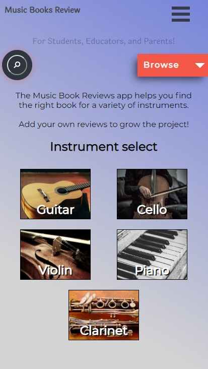
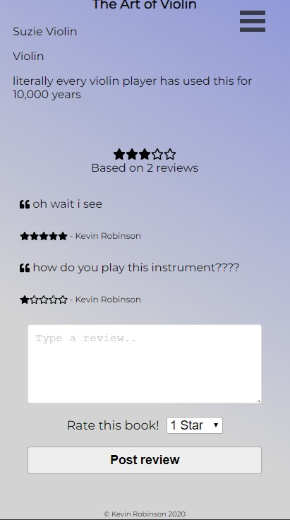

Music Book Reviews App

## Live Link
https://music-book-review-app.now.sh/

## Summary
An app for reviewing music books intended for students, teachers, and parents.  Trying to find just the right book?  This app should help you on your way.

## API used

https://github.com/hotdogmcgee/music-book-review--server

## Screenshots

Home Page

Browse books by category

Look at a book and submit a review

## How to use the app

To use full functionality of app you must login or register.  A testing username has been provided, please look at the how-to section of the app itself.

## Technology Used

React, Node.js, Heroku, Now/Zeit, Postgresql, HTML, CSS